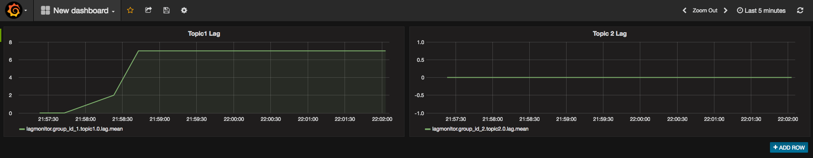

# Kafka Lag Monitor

An application to periodically query Kafka lag metrics and send to statsd.

## Set Up
To build a Docker image locally:

```
$ docker build . -t lagmonitor
```

To run locally:

```
$ docker run lagmonitor
```

To run locally with Docker Compose and link to a local Grafana instance: 

```
$ docker-compose up -d
```

Note: You may wish to replace references to `10.200.10.1` in config.yaml and docker-compose.yml, or alias `lo0` to this address, e.g. `ifconfig lo0 alias 10.200.10.1/24`. This is a workaround for a Docker for Mac limitation which can be ignored if you're not using Docker for Mac.


## Viewing Lag Graphs with Grafana 
The Grafana image bundled in the Compose file is documented [here](https://github.com/samuelebistoletti/docker-statsd-influxdb-grafana).

1. Set up the Grafana datasource using the instructions provided at the link above.
2. Send some example messages to the test topic, you could use [this script](https://github.com/lucrussell/kafka-tools/blob/master/partition_sender.py) or a similar one.
2. After doing so, you should be able to set up a dashboard like the one shown below.
3. The metric to select from will be in the format `lagmonitor.<group_name>.<topic_name>.<partition_id>.lag`, for example `lagmonitor.group_id_1.topic1.0.lag`.

 